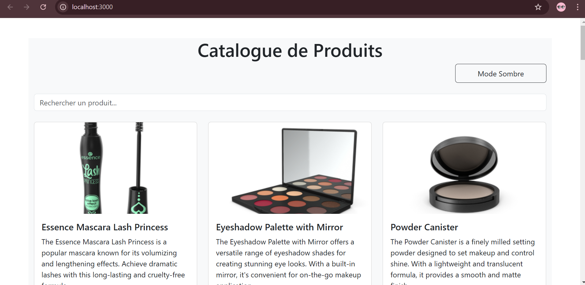
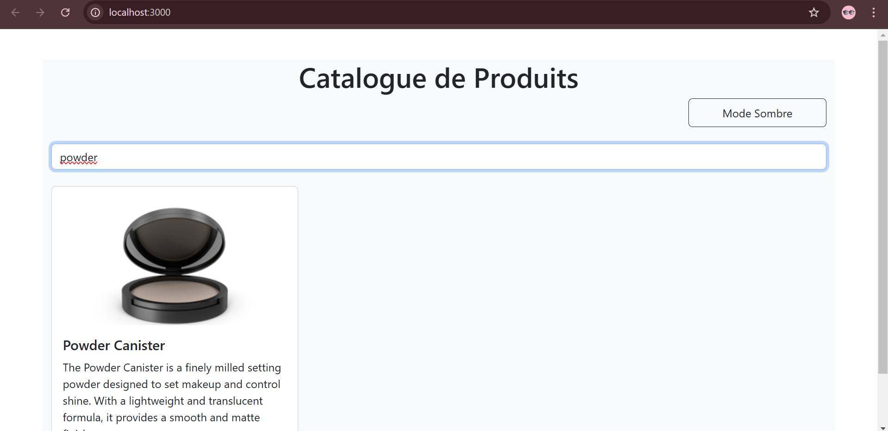
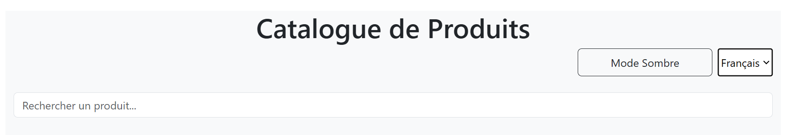
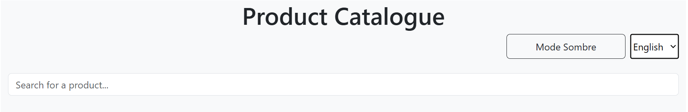
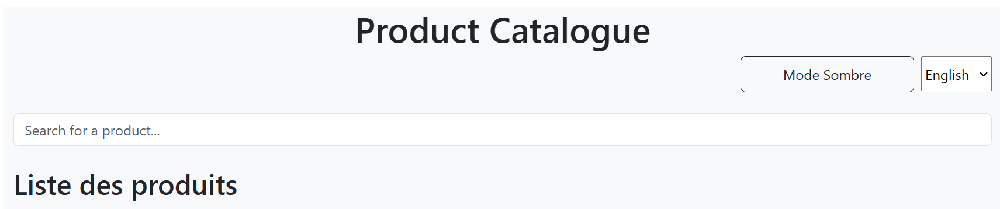
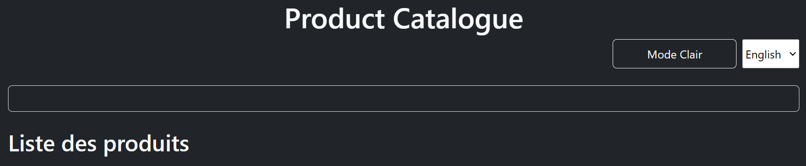

# TP React Hooks - Application de Gestion de Produits

## Exercice 1: Recherche en temps réel

### Objectif :
L'objectif de cet exercice était d'implémenter une fonctionnalité de recherche en temps réel. Quand un utilisateur tape un terme dans la barre de recherche, la liste des produits doit se filtrer pour ne montrer que ceux qui correspondent à ce terme.

### Solution :
- **Filtrage en temps réel** : J'ai utilisé le hook `useState` pour maintenir l'état du terme de recherche, et j'ai utilisé `useEffect` pour filtrer les produits en fonction de ce terme.
- **Débounce** : Pour éviter d'effectuer une recherche à chaque frappe, j'ai implémenté un **debounce** (délai d'attente) afin de ne lancer la recherche qu'après un certain temps d'inactivité de l'utilisateur (ce qui réduit les requêtes inutiles).
- **Affichage dynamique** : Le filtrage des produits est effectué sur le titre des produits et l'affichage est mis à jour en temps réel sans avoir besoin de recharger la page.

### Fonctionnement :
1. L'utilisateur tape un texte dans la barre de recherche.
2. Le filtre est appliqué en temps réel sur les produits dont le titre correspond au texte saisi.
3. Les produits sont affichés dynamiquement sur la page.

### Capture d'écran avant la recherche :

### Capture d'écran après avoir saisi un terme de recherche :

## Exercice 2 : Context et Internationalisation

### Solution
Pour cet exercice, j'ai créé un contexte (`LanguageContext`) pour gérer la langue de l'application (anglais/français). Ce contexte permet de rendre l'application multilingue en fonction du choix de l'utilisateur.

### Capture d'écran
### Capture d'écran avant la recherche :

### Capture d'écran après avoir saisi un terme de recherche :

### Difficultés rencontrées
- Gérer l'état global de la langue a été un peu difficile au début, mais avec l'aide de `useContext`, j'ai pu rendre l'état accessible à tous les composants sans avoir besoin de passer les props manuellement.

---
## Exercice 3 : Hooks Personnalisés

### Solution
J'ai créé un hook personnalisé `useTheme` pour simplifier l'utilisation du thème sombre/clair dans toute l'application. Ce hook permet d'utiliser facilement et de manière réutilisable l'état du thème dans n'importe quel composant.

### Capture d'écran
### Capture d'écran avant la recherche :

### Capture d'écran après avoir saisi un terme de recherche :

### Difficultés rencontrées
- Au début, je n'étais pas sûr de la meilleure manière d'exposer le contexte via un hook personnalisé. Après quelques recherches, j'ai compris que l'utilisation de `useContext` dans un hook personnalisé simplifie la gestion de l'état.

---
## Exercice 4 : Gestion Asynchrone et Pagination

### Solution
Dans cet exercice, j'ai intégré une API externe pour récupérer des produits. J'ai utilisé `useEffect` pour effectuer la requête API et gérer l'état des produits récupérés. La pagination est gérée en stockant la page actuelle et les produits à afficher dans l'état.

### Difficultés rencontrées
- J'ai eu quelques difficultés avec la gestion de la pagination et l'optimisation des appels API pour ne récupérer les produits que lorsque c'était nécessaire. J'ai résolu cela en ajoutant des conditions dans le `useEffect` pour ne récupérer les données que lorsque la page change.

---

